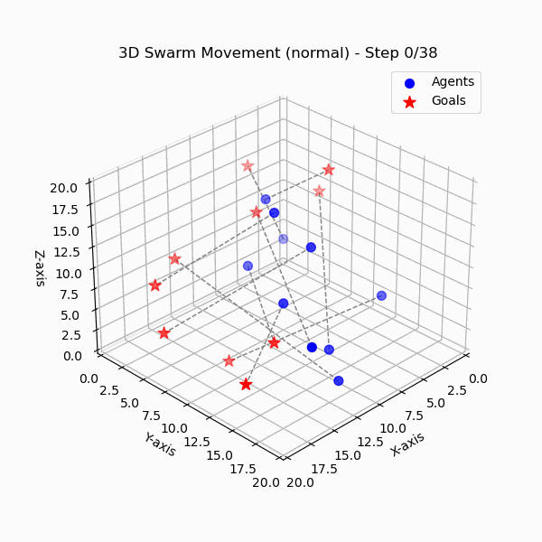
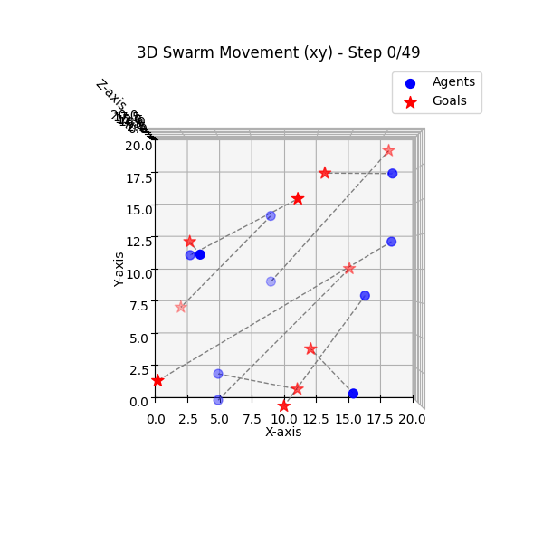
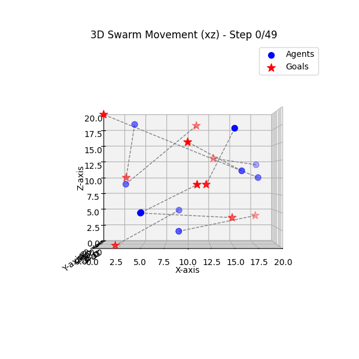
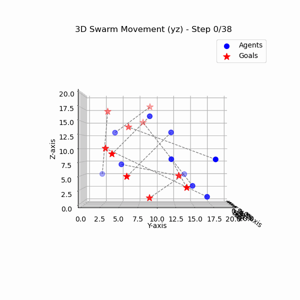

## note 12/11
agent prefer to stack on the top of the space for prevent collision, need to eliminate it's way to gain high score without reaching goal
### note 15/11
agents influence by is neighbor's behavior, two tasks todo: 1. add neighbor's goal to its observation 2. replace the environment step to matrix operations for speed up training

### note office hour 15/11
0. 3 4 agents work is for milestone 1
1. some agent close, stop one of them 
2. stop is ok 
3. reduce the neighbors to 1 closest (which is also the closest obsticle distance)
4. do the minimum scale of training, log how the action being and see if it select actions as intended
5. the agents should have ability to move around 

### note 19/11
1. revising from another contributor working (see git history), 50% faster, with the soft update of target network, training result become stable
2. under relatively small range of output actions, the model converge well, but with large scale (fro 85 output actions increase to 337 output actions), the agents again stuck in the middle of its way 
3. the current method of generating action set may create duplicate actions, negatively impact the even distribution of policy 
4. need to exam overfitting later, not sure if have it for now
5. jupyter notebook not working very well on pycharm ... 
    #### todo 
    1. someone try to implement logic of cut the episode once the agent start to "stuck" (shaking around it's position)
    2. someone should responsible for testing the agent's behavior and summerize it so that others can know what to tune

### note 20/11
1. able to train stable model, successful model data is stored in the folder successful_model_and_replay
   result:

   
2. the action set generation is still wrong, although the neural network can fix itself, but to make it correct is still reasonable since it can eliminate bias on action selection
3. experimenting if it's good for add a panely relative to it's neighbor (the last one is shaking at the end, but blocking occured less)

### note 27/11
1. new contributer fixed the duplicate action problem (see branch history for details)
2. removed the logic of stick the agent in place after reach goal, thus the agents able to learn to "stop" after reaching goal 
3. it able to approaching to agent in given time 
4. next step: make it behave more stable after get close enough to goal 

# TODO 
(solved) someone please try fix the generate action set, the current generating function produce a lot of overlap actions (for example, it contains a lot of duplicate (0,0,1) actions), which is a mathematical issue

